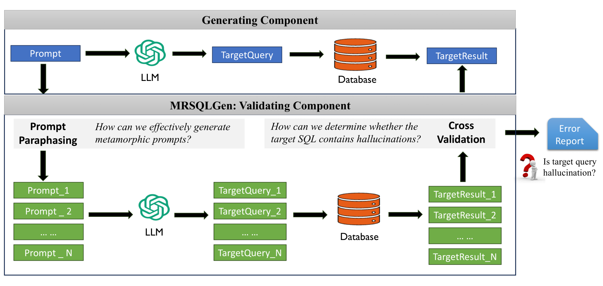
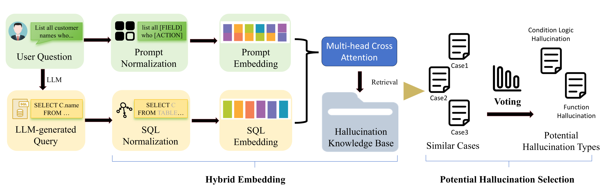

## 1 MRSQLGen
The workflow of MRSQLGen consists of two modules: **Prompt Paraphrasing and Cross Validation**.

### 1.1 Prompt Paraphrasing
This module involves the following steps:
1. Empirical Study of Hallucinations
    - **[_Empirical Study Results_](EmpiricalStudyResults)** 
    - **[_Hallucination Knowledge Base(HKB)_](HallucinationKnowledgeBaseMerge)** 
2. [Hallucination Type Retrieval](app/hallucination_type_retrieval) 

3. Metamorphic Rule Selection and Adaptation
    -  **[_Metamorphic Rules_](MetamorphicPromptList)** 
    - [Metamorphic Rules Adaptation](app/prompt_transformer)
### 1.2 Cross Validation
1. [Metamorphic Relationship Checker](app/MR_checker) 
2. [Hallucination Detector](app/bug_detector.py) 
### 1.3 Prompt Template: DAIL_SQL_Prompt
We employ the in-context learning prompt strategy [DAIL-SQL](app/DAIL_SQL_Prompt), which, as of January 2025, has achieved the best performance on the Spider benchmarks. All configurations follow the DAIL-SQL setup, including the nuclear sampling strategy and a temperature setting of 0.